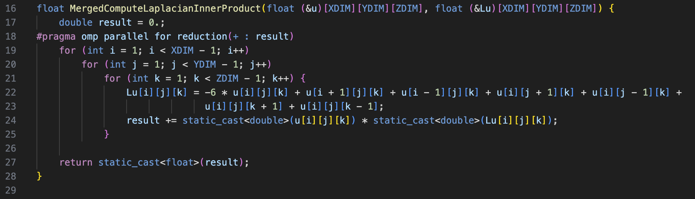
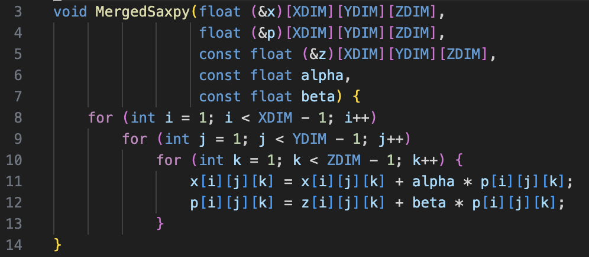

# COMP SCI 557 Assignment 2

## Environment

-   CPU: `AMD Ryzen 7 7735HS with Radeon Graphics`
-   Memory: `Configured Memory Speed: 4800 MT/s, dual channel`
-   Compiler: `g++ (Ubuntu 13.3.0-6ubuntu2~24.04) 13.3.0`
-   OS: `Ubuntu 24.04.2 LTS (Noble Numbat)`
-   Compile commands:
    ```bash
    $ make -j
    g++ -O3 -g -std=c++20 -Wall -fopenmp -c main.cpp -o main.o
    g++ -O3 -g -std=c++20 -Wall -fopenmp -c ConjugateGradients.cpp -o ConjugateGradients.o
    g++ -O3 -g -std=c++20 -Wall -fopenmp -c Laplacian.cpp -o Laplacian.o
    g++ -O3 -g -std=c++20 -Wall -fopenmp -c PointwiseOps.cpp -o PointwiseOps.o
    g++ -O3 -g -std=c++20 -Wall -fopenmp -c Reductions.cpp -o Reductions.o
    g++ -O3 -g -std=c++20 -Wall -fopenmp -c Utilities.cpp -o Utilities.o
    g++ -O3 -g -std=c++20 -Wall -fopenmp -fno-strict-aliasing -c MergedOp.cpp -o MergedOp.o
    g++ main.o ConjugateGradients.o Laplacian.o PointwiseOps.o Reductions.o Utilities.o MergedOp.o -o solver -fopenmp
    ```

## Task 1

### Changes Made to Collect Timing Info

1. In `ConjugateGradients.cpp`, I did the following
    - Declared lots of `extern Timer`
    - Wrapped each kernel function around a independent `Timer`
    - Disabled the `WriteAsImage` function to remove image output
2. In `main.cpp`, I did the following
    - Declared lots of `Timer` in global section
    - For each of the `Timer`, their address is pushed to a `std::vector<Timer *>` for management
    - Created a `std::vector<std::string>` to store information about each `Timer` pointer in the `std::vector<Timer *>`
    - Reset the timer before calling the conjugate gradients algorithm
    - Wrapped `ConjugateGradients` function around a timer to get total runtime
    - Print per kernel cumulative runtime
    - Print per kernel average runtime

As can been seen in below diagram, the sum is almost equal to the total time taken, verifying that this step is done
correctly.

### Timing Info

| Line | Operation                     | 1-Thread Cumulative (ms) | 1-Thread Per Avg. (ms) | 16-Thread Cumulative (ms) | 16-Thread Avg. (ms) |
| ---- | ----------------------------- | ------------------------ | ---------------------- | ------------------------- | ------------------- |
| 2    | ComputeLaplacian(x, z)        | 46.5141                  | 0.181696               | 13.634                    | 0.053258            |
| 6    | ComputeLaplacian(p, z)        | 2349.49                  | 9.17771                | 1765.05                   | 6.89471             |
| 4    | Copy(r, p)                    | 37.8532                  | 0.147864               | 6.09127                   | 0.023794            |
| 13   | Copy(r, z)                    | 1600.19                  | 6.25075                | 1320.03                   | 5.15637             |
| 4    | InnerProduct(p, r)            | 16.4926                  | 0.0644242              | 3.56605                   | 0.0139299           |
| 6    | InnerProduct(p, z)            | 2883.99                  | 11.2656                | 989.452                   | 3.86505             |
| 13   | InnerProduct(z, r)            | 2854.33                  | 11.1497                | 952.401                   | 3.72031             |
| 2    | Norm(r)                       | 6.58686                  | 0.0257299              | 2.02624                   | 0.00791502          |
| 8    | Norm(r)                       | 1153.37                  | 4.50534                | 516.433                   | 2.01731             |
| 2    | Saxpy(z, f, r, -1)            | 40.7673                  | 0.159247               | 47.1377                   | 0.184132            |
| 8    | Saxpy(z, r, r, -alpha)        | 1664.2                   | 6.50079                | 1717.37                   | 6.70848             |
| 9-12 | Saxpy(p, x, x, alpha)         | 6.85812                  | 0.0267895              | 7.11839                   | 0.0278062           |
| 16   | Saxpy(p, x, x, alpha)         | 1772.35                  | 6.92325                | 1761.47                   | 6.88073             |
| 16   | Saxpy(p, r, p, beta)          | 1673.02                  | 6.53522                | 1724.05                   | 6.73458             |
| 1-18 | **Conjugate Gradients Sum**   | **16106.01218**          | -                      | **10825.82965**           | -                   |
| 1-18 | **Conjugate Gradients Total** | **16112.5**              | -                      | **10833**                 | -                   |

## Task 2

### Implementation of Kernel Function

#### Merging Line 6



Implementation can be found at `./task_2/MergedOp.cpp` at `line 16-28`

As can be seen in the above and below timing info, for running with a single thread, before merging line 6, it takes
`2349.49 + 2883.99 = 5233.48 ms` to complete; after merging, it takes `5062.44 ms` to complete.
We can see a boost of `3.27%`.

For running with all threads (16 threads), before merging line 6, it takes `1765.05 + 989.452 = 2754.502 ms` to complete;
after merging, it takes `1895.96 ms` to complete. We can see a boost of `36.17%`.

#### Merging Line 16



Implementation can be found at `./task_2/MergedOp.cpp` at `line 3-14`

As can be seen in the above and below timing info, for running with a single thread, before merging line 16, it takes
`1772.35 + 1673.02 = 3445.37 ms` to complete; after merging, it takes `2724.3 ms` to complete.
We can see a boost of `20.93%`.

For running with all threads (16 threads), before merging line 16, it takes `1761.47 + 1724.05 = 3485.52 ms` to complete;
after merging, it takes `2829.22` to complete. We can see a boost of `18.83%`.

### How I Linked the File

I included the header file `MergedOp.h` in `main.cpp`, and using the `Makefile`, `MergedOp.cpp` is
compiled into an object file `MergedOp.o`. Then, `MergedOp.o` is linked to the final executable `solver`

### Timing Info with Line 6 and 16 merged

| Line | Operation                                | 1-Thread Cumulative (ms) | 1-Thread Per Avg. (ms) | 16-Thread Cumulative (ms) | 16-Thread Avg. (ms) |
| ---- | ---------------------------------------- | ------------------------ | ---------------------- | ------------------------- | ------------------- |
| 2    | ComputeLaplacian(x, z)                   | 46.8384                  | 0.182963               | 14.2677                   | 0.0557334           |
| 6    | MergedComputeLaplacianInnerProduct(p, z) | 5062.44                  | 19.7752                | 1895.96                   | 7.4061              |
| 4    | Copy(r, p)                               | 36.7851                  | 0.143692               | 5.0267                    | 0.0196355           |
| 13   | Copy(r, z)                               | 1644.48                  | 6.42376                | 1331.44                   | 5.20093             |
| 4    | InnerProduct(p, r)                       | 16.4903                  | 0.0644151              | 3.60943                   | 0.0140993           |
| 13   | InnerProduct(z, r)                       | 2848.12                  | 11.1255                | 997.232                   | 3.89544             |
| 2    | Norm(r)                                  | 6.72545                  | 0.0262713              | 2.77454                   | 0.010838            |
| 8    | Norm(r)                                  | 1153.96                  | 4.50766                | 618.402                   | 2.41563             |
| 2    | Saxpy(z, f, r, -1)                       | 39.0947                  | 0.152714               | 43.7447                   | 0.170878            |
| 8    | Saxpy(z, r, r, -alpha)                   | 1742.07                  | 6.80495                | 1930.35                   | 7.54042             |
| 9-12 | Saxpy(p, x, x, alpha)                    | 6.69216                  | 0.0261413              | 8.07225                   | 0.0315322           |
| 16   | MergedSaxpy(p, x, r, x, alpha, beta)     | 2724.3                   | 10.6418                | 2829.22                   | 11.0516             |
| 1-18 | **Conjugate Gradients Total**            | **15334.5**              | -                      | **9687.6**                | -                   |

### Comments

In the implementation process, I ensure the merged version behaves like the original version by comparing their output
image file using the following command:

```bash
for file in task_1/x.*.pgm; do
    fname=$(basename "$file")
    cmp "$file" "task_2/$fname"
done
```

With line 6 and 16 being merged, the performance of the application with single-core and multi-core both have an upgrade of `4.8%` and `10.6%`,
respectively. Having only line 6 or only line 16 merged also shows a performance boost.

The performance might be able to enhance if `OpenMP` is used in the `Saxpy` function, or in line 16. Also, some
call of `Saxpy` has its pointer aliased, which prevents us from adding `-fno-strict-aliasing` flags to the files for
more aggressive optimization, even though in the Merged version, I have tried to use `-fno-strict-aliasing` flag
and do **NOT** see any performance improvements.

In summary, the performance boost is likely due to less function calls, less memory access and better cache locality.
We do **NOT** need to access the same place twice because they're already in the cache.
